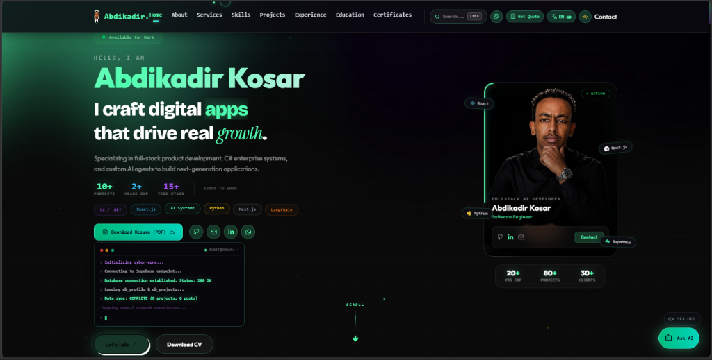
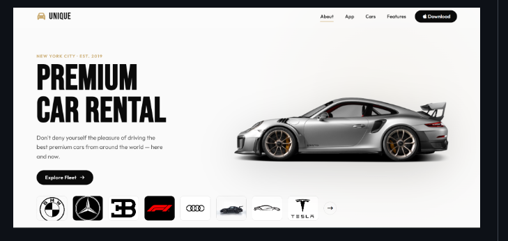

# 🚀 Abdikadir Kosar — AI Engineer & Full-Stack Architect Portfolio

<div align="center">



[](https://abdikadirkosar.dev)
[](https://react.dev)
[](https://tailwindcss.com)
[](https://supabase.com)
[](https://t.me/abdikadir_portfolio_bot)
[](https://python.org)

**Building Next-Generation Intelligent Applications, Generative AI Pipelines, and High-Performance Cloud Architectures.**

[🌐 Visit Live Portfolio](https://abdikadirkosar.dev) • [📄 Download Resume (PDF)](./public/Abdikadir_Kosar_Osman_CV.pdf) • [📲 Telegram Bot](https://t.me/abdikadir_portfolio_bot) • [📩 Contact Abdikadir](mailto:abdikadirkosara@gmail.com)

</div>

---

## 🌟 Key Features & Innovations

- **📱 Instant Telegram Bot Notification Engine (`@abdikadir_portfolio_bot`)**:
  - Integrated Telegram Bot API (`src/lib/telegram.js`) that immediately pings Abdikadir's phone in real-time whenever a visitor submits a contact inquiry or requests a project quote estimate!

- **🔔 Admin Panel Real-Time Unread Message System**:
  - Live glowing unread counter badge (`Messages 🔴 3`) in the admin sidebar & top header bell icon. Plays an interactive Web Audio chime alert and displays desktop toast alerts on new incoming messages.

- **🎨 Professional Re-Architected Navigation Bar (NavBar v3.0)**:
  - Sleek 3-tier layout: Logo (left), 5 Core links + "More ▼" secondary dropdown (center), and Search + "✨ Tools ▼" dropdown + Language toggle (EN/SO) + Theme toggle + Contact CTA (right).

- **🔊 Web Audio API Procedural Sound Engine (SFX)**:
  - Lightweight, file-less Web Audio API sound engine providing interactive hover pings, percussive click pops, scroll whooshes, and harmonic section chords (enabled by default with localStorage preference saving).

- **🤖 Interactive Floating AI Assistant ("Ask Abdikadir's AI")**:
  - Embedded floating conversational bot with custom knowledge engine answering visitor inquiries in both Somali 🇸🇴 and English 🇬🇧 with quick prompt pills!

- **💻 Interactive Web Shell Terminal v2.4**:
  - High-tech CLI embedded directly into the portfolio layout supporting commands `help`, `whoami`, `skills`, `projects`, `contact`, `hire`, `theme`, and `clear`.

- **🌐 Synchronized Multi-Language Suite (Somali 🇸🇴 & English 🇬🇧)**:
  - 1-click seamless translation toggle updating all sections, modals, titles, and chatbot prompts in real-time.

- **⌨️ Command Palette Spotlight Search (`Ctrl + K`)**:
  - Spotlight search overlay allowing instant navigation to any section or setting.

- **🚀 Interactive AI Live Playground**:
  - Live console demo for testing simulated AI model pipelines (GPT-4o RAG, Claude 3.5 Agents, YOLOv8 Computer Vision).

- **🧮 Project Scope & Cost Estimator Calculator**:
  - Client quote calculator modal estimating project timeline (weeks) and budget ($) based on selected services and add-ons.

- **🎨 Custom Accent Color Switcher**:
  - Live accent palette switcher (Emerald Mint 💚, Electric Cyan 💙, Cyber Purple 💜, Sunset Amber 💛, Crimson Rose ❤️).

- **🌙☀️ Frost Pearl & Obsidian Dual Theme Engine**:
  - Default **Dark Obsidian Mode** (`#0a0a0f`) with glowing emerald accents and **Nordic Frost Pearl Light Mode** (`#F1F5F9`) with solid dark slate typography (`#0F172A`).

- **⚡ Vite 8 & Rolldown Smart Code-Splitting**:
  - Optimized vendor chunking (`React`, `Framer Motion`, `GSAP`, `Supabase`, `Three.js`, `React Icons`) delivering ultra-fast sub-200kB initial loads and zero CORS errors.

---

## 💻 Featured Innovations & Applications

<div align="center">

### 🚗 UNIQUE — Premium Car Rental & Fleet Management System



*A luxury car rental & fleet reservation platform featuring interactive vehicle search, instant booking, dynamic price calculators, and sleek dark/light user interfaces.*

</div>

---

## 🛠️ Tech Stack & Architecture

| Category | Technologies & Tools |
| :--- | :--- |
| **AI & Machine Learning** | PyTorch, TensorFlow, RAG Architecture, Peft/LoRA, LangChain, OpenCV, YOLOv8 |
| **Frontend & UI** | React 19, Next.js, Tailwind CSS v4, Framer Motion, GSAP, Lucide Icons |
| **Backend & APIs** | Python, Node.js, Express, FastAPI, Django, Telegram Bot API, REST & GraphQL |
| **Database & Storage** | PostgreSQL, Supabase RLS, MongoDB, Redis, pgvector |
| **DevOps & Cloud** | AWS, GCP, Docker, GitHub Actions CI/CD, Vercel Edge Deployments |

---

## 🚀 Quick Start & Local Setup

```bash
# 1. Clone repository
git clone https://github.com/Abdikadirkosar/Abdikadir_Portofolio.git

# 2. Navigate to directory
cd Abdikadir_Portofolio

# 3. Install dependencies
npm install

# 4. Configure environment variables (.env)
VITE_SUPABASE_URL=https://your-supabase-url.supabase.co
VITE_SUPABASE_ANON_KEY=your-supabase-anon-key
VITE_TELEGRAM_BOT_TOKEN=8964811758:AAHSYIsRyqP7GXML1e_unzL8etfc3jaOxVM
VITE_TELEGRAM_CHAT_ID=5515076086

# 5. Start local development server
npm run dev
```

---

<div align="center">

Designed & Engineered with ❤️ by **Abdikadir Kosar Osman**

</div>
